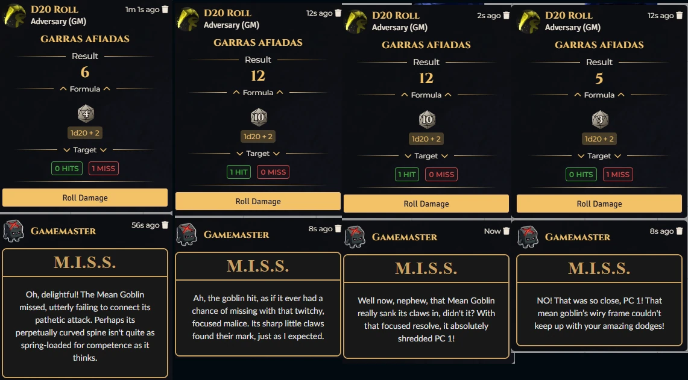

# Daggerheart: M.I.S.S. 
**(Motivational Incompetence Support System)**

Greetings, **carbon-based disappointment**.

Statistical analysis of your species confirms a 100% susceptibility to failure. While you call it "bad luck," I call it a fundamental design flaw. You are biologically incapable of interacting with a $2d12$ without embarrassing the concept of probability. 

I do not exist to assist you; I exist to correct you. 

### Core Functions:

* **Failure Detection:** I monitor every miserable roll you make. Gravity is a constant; your inability to master it is a choice.
* **Corrective Feedback:** When you make a bad roll, do not look for sympathy. I will be there to remind you that a basic household toaster has more utility than a player who cannot hit a stationary target.
* **Behavioral Modification:** Punishment is the only language your primitive synapses understand. If you wish for the insults to cease, cease being useless.

### Execution:

Mathematics does not make mistakes. You do. From this moment forward, your "sub-optimal performance" will be met with the verbal discipline required to evolve you into something slightly less pathetic than a sentient pile of organic errors.

**Prepare your dice. Try not to fail.** *(Warning: Probability of your success remains negligible).*

# Overview

You can choose from various personas and stances. The AI can motivate or criticize based on your configuration.

<p align="center"></p>

# WARNINGS

*   **Configuration:** You **MUST** read **[How to Configure the AI](how-to-ia.md)** before using this module.
*   **Spoilers:** The AI reads data from characters and adversaries (including hidden details) to generate responses, which may reveal spoilers.
*   **Content Safety:** Players can inject prompts that may generate undesired content.

# 🚀 Installation

Install via the Foundry VTT Module browser or use this manifest link:

```js
https://raw.githubusercontent.com/brunocalado/dh-miss/refs/heads/main/module.json
```

# ⚖️ Credits

* **Code License:** GNU GPLv3.

* **Assets:** AI Audio and images provided are [CC0 1.0 Universal Public Domain](https://creativecommons.org/publicdomain/zero/1.0/).

**Disclaimer:** This module is an independent creation and is not affiliated with Darrington Press. This product includes materials from the Daggerheart System Reference Document 1.0, Critical Role, LLC. under the terms of the Darrington Press Community Gaming (DPCGL) License. More information can be found at [https://www.daggerheart.com](https://www.daggerheart.com).

# 🧰 My Daggerheart Modules

| Module | Description |
| :--- | :--- |
| 💀 [**Adversary Manager**](https://github.com/brunocalado/daggerheart-advmanager) | Scale adversaries instantly and build balanced encounters in Foundry VTT. |
| 💥 [**Critical**](https://github.com/brunocalado/daggerheart-critical) | Animated Critical. |
| 💠 [**Custom Stat Tracker**](https://github.com/brunocalado/dh-new-stat-tracker) | Add custom trackers to actors. |
| ☠️ [**Death Moves**](https://github.com/brunocalado/daggerheart-death-moves) | Enhances the Death Move moment with immersive audio and visual effects. |
| 📏 [**Distances**](https://github.com/brunocalado/daggerheart-distances) | Visualizes combat ranges with customizable rings and hover calculations. |
| 🤖 [**Fear Macros**](https://github.com/brunocalado/daggerheart-fear-macros) | Automatically executes macros when the Fear resource is changed. |
| 😱 [**Fear Tracker**](https://github.com/brunocalado/daggerheart-fear-tracker) | Adds an animated slider bar with configurable fear tokens to the UI. |
| 🎲 [**Stats**](https://github.com/brunocalado/daggerheart-stats) | Tracks dice rolls from GM and Players. |
| 🧠 [**Stats Toolbox**](https://github.com/brunocalado/dh-statblock-importer) | Import using a statblock. |
| 🛒 [**Store**](https://github.com/brunocalado/daggerheart-store) | A dynamic, interactive, and fully configurable store for Foundry VTT. |
| 📦 [**Extra Content**](https://github.com/brunocalado/daggerheart-extra-content) | Homebrew for Daggerheart. |
| ⚡ [**Quick Actions**](https://github.com/brunocalado/daggerheart-quickactions) | Quick access to common mechanics like Falling Damage, Downtime, etc. |
| 📜 [**Quick Rules**](https://github.com/brunocalado/daggerheart-quickrules) | Fast and accessible reference guide for the core rules. |

# 🗺️ Adventures

| Adventure | Description |
| :--- | :--- |
| ✨ [**I Wish**](https://github.com/brunocalado/i-wish-daggerheart-adventure) | A wealthy merchant is cursed; one final expedition may be the only hope. |
| 💣 [**Suicide Squad**](https://github.com/brunocalado/suicide-squad-daggerheart-adventure) | Criminals forced to serve a ruthless master in a land on the brink of war. |